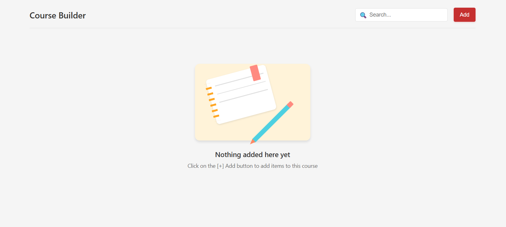

# 📚 Course Builder Application

A modern, interactive React.js application that allows educators and content creators to organize and manage course materials. This feature-rich application provides an intuitive interface for building structured courses with modules, resources, and interactive elements.



## 🎥 Demo Video

[▶️ Watch Demo Video](https://drive.google.com/file/d/1vbLE0gbuBXuwIW-KMRHPiikF2OMLvZNF/view?usp=sharing)


## 🎯 Key Features

- **Module Management**
  - Create, rename, and organize course modules
  - Expandable/collapsible module views
  - Intuitive drag-and-drop reordering

- **Resource Management**
  - Upload and manage files (PDFs, images, documents)
  - Add external links with URL validation
  - Download resources with original file integrity
  - Support for various file types with proper previews

- **Interactive Course Outline**
  - Real-time navigation between modules
  - Automatic scroll synchronization
  - Visual hierarchy of course structure
  - Active module highlighting

- **Advanced Search**
  - Instant search across all content
  - Smart filtering by module or resource
  - Highlights matching items
  - Handles special characters and case sensitivity

- **User Experience**
  - Responsive design for all devices
  - Smooth animations and transitions
  - Intuitive drag-and-drop interface
  - Comprehensive error handling

## 🚀 Getting Started

### Prerequisites
- Node.js (v16 or higher)
- npm (v8 or higher) or yarn

### Installation

1. Clone the repository:
   ```bash
   git clone https://github.com/yourusername/course-builder.git
   cd course-builder
   ```

2. Install dependencies:
   ```bash
   npm install
   # or
   yarn install
   ```

3. Start the development server:
   ```bash
   npm run dev
   # or
   yarn dev
   ```

4. Open [http://localhost:5173](http://localhost:5173) in your browser.

## 🧪 Testing

Run the test suite with:
```bash
npm test
# or
yarn test
```

## 🛠 Tech Stack

- **Frontend Framework**: React 19.1.0
- **Build Tool**: Vite 6.3.5
- **State Management**: React Hooks
- **Drag & Drop**: react-dnd 16.0.1
- **Testing**: Jest, React Testing Library
- **Styling**: CSS Modules

## 🐛 Bug Fixes & Improvements

### Fixed Issues
- **File Download**: Resolved invalid PDF generation by implementing proper file data handling
- **Outline Sync**: Improved active module detection during scroll
- **Search**: Fixed case sensitivity and special character handling
- **Performance**: Optimized re-renders and state updates

### Recent Improvements
- Added comprehensive test coverage
- Improved accessibility (a11y)
- Enhanced mobile responsiveness
- Added loading states and error boundaries

## 📂 Project Structure

```
src/
  ├── components/
  │   ├── modules/          # Main application components
  │   │   ├── CourseBuilder.jsx
  │   │   ├── DraggableModule.jsx
  │   │   ├── ModuleItem.jsx
  │   │   └── ...
  │   └── ui/               # Reusable UI components
  │       ├── Outline.jsx
  │       ├── Header.jsx
  │       └── ...
  ├── __tests__/            # Test files
  ├── App.css               # Global styles
  └── main.jsx              # Application entry point
```

## 🤝 Contributing

1. Fork the repository
2. Create your feature branch (`git checkout -b feature/AmazingFeature`)
3. Commit your changes (`git commit -m 'Add some AmazingFeature'`)
4. Push to the branch (`git push origin feature/AmazingFeature`)
5. Open a Pull Request

## 📄 License

This project is licensed under the MIT License - see the [LICENSE](LICENSE) file for details.

---

Made with ❤️ by [Your Name] | [Your Website]

## 🚀 Features

### ✅ Completed Features

- **Module Management**
  - ✅ Create, edit, and delete course modules
  - ✅ Expandable/collapsible module views
  - ✅ Module renaming with inline editing

- **Resource Management**
  - ✅ Add links with title and URL validation
  - ✅ Upload files (images, PDFs, documents) with file size display
  - ✅ Rename and delete resources
  - ✅ Support for standalone resources (outside modules)

- **Drag & Drop Functionality**
  - ✅ Reorder modules by dragging
  - ✅ Move resources between modules
  - ✅ Drag resources within the same module
  - ✅ Visual feedback during drag operations

- **Course Outline**
  - ✅ Sidebar outline with module navigation
  - ✅ Click-to-scroll functionality
  - ✅ Automatic highlighting of active module on scroll
  - ✅ Responsive design for mobile devices

- **Search Functionality**
  - ✅ Real-time search across modules and resources
  - ✅ Search by module name, resource title, URL, or filename
  - ✅ Smart filtering that shows parent modules for matching resources
  - ✅ "No results" state with helpful messaging

- **User Interface**
  - ✅ Modern, clean design following Figma specifications
  - ✅ Responsive layout for desktop, tablet, and mobile
  - ✅ Intuitive modal dialogs for adding/editing content
  - ✅ Smooth animations and transitions
  - ✅ Empty states with clear call-to-action

## 🛠 Technology Stack

- **Frontend Framework**: React 19.1.0
- **Build Tool**: Vite 6.3.5
- **Drag & Drop**: react-dnd 16.0.1
- **Icons**: react-icons 5.0.1
- **Styling**: Pure CSS with modern features
- **Code Quality**: ESLint + Prettier

## 🏃‍♂️ Getting Started

### Prerequisites

- Node.js (v18 or newer recommended)
- npm (v9 or newer recommended)

### Installation

1. Clone the repository or download the source code:

```bash
git clone <repository-url>
# or extract from provided ZIP file
```

2. Navigate to the project directory:

```bash
cd toddle-test-app
```

3. Install the dependencies:

```bash
npm install
```

### Development

To start the development server:

```bash
npm run dev
```

This will start the development server at `http://localhost:5173`.

### Building for Production

To build the project for production:

```bash
npm run build
```

The build artifacts will be stored in the `dist/` directory.

### Preview Production Build

To preview the production build locally:

```bash
npm run preview
```

## 🚀 Deployment

### Netlify Deployment

1. Build the project:
   ```bash
   npm run build
   ```

2. Upload the `dist` folder to Netlify or connect your Git repository

3. Set build settings:
   - Build command: `npm run build`
   - Publish directory: `dist`

### Vercel Deployment

1. Connect your repository to Vercel
2. Set framework preset to "Vite"
3. Deploy with default settings

### Manual Deployment

1. Run `npm run build`
2. Upload the contents of the `dist` folder to your web server
3. Ensure your server is configured to serve the `index.html` for all routes

## 🎯 Usage Guide

### Creating Your First Course

1. **Add a Module**: Click the "Add" button and select "Create module"
2. **Add Resources**: 
   - Click the "+" button within a module to add links or upload files
   - Or use the main "Add" button to create standalone resources
3. **Organize Content**: Drag and drop modules and resources to reorder them
4. **Navigate**: Use the outline sidebar to quickly jump between modules
5. **Search**: Use the search bar to quickly find specific content

### Key Features

- **Expandable Modules**: Click on any module header to expand/collapse its contents
- **Drag & Drop**: Grab any module or resource to reorder or move between modules
- **Quick Actions**: Right-click or use the menu button (⋮) for edit/delete options
- **Responsive Design**: Works seamlessly on desktop, tablet, and mobile devices
## Folder Structure

```
my-react-app/
├── eslint.config.js     # ESLint configuration
├── .prettierrc          # Prettier configuration
├── .prettierignore      # Files to ignore by Prettier
├── .vscode/             # VS Code settings
├── public/              # Public assets
├── src/                 # Source files
│   ├── assets/          # Static assets
│   ├── components/      # React components (add as needed)
│   ├── App.jsx          # Root component
│   └── main.jsx         # Entry point
└── index.html           # HTML template
```

```
src/
  ├── components/
  │   ├── modules/
  │   │   ├── CourseBuilder.jsx     # Main component that orchestrates the application
  │   │   ├── ModuleCard.jsx        # Component for displaying individual modules
  │   │   ├── ModuleModal.jsx       # Modal for creating/editing modules
  │   │   ├── ModuleItem.jsx        # Component for displaying module items (links, files)
  │   │   ├── LinkModal.jsx         # Modal for adding links to modules
  │   │   └── UploadModal.jsx       # Modal for uploading files to modules
  │   └── ui/
  │       ├── Header.jsx            # Application header with search and dropdown
  │       └── EmptyState.jsx        # Shown when no modules exist
  ├── assets/
  ├── App.jsx                       # App entry point
  ├── App.css                       # Application styling
  ├── main.jsx
  └── index.css
```

## Application Architecture

### Component Hierarchy

```
App
└── CourseBuilder
    ├── Header
    ├── EmptyState (conditionally rendered)
    ├── ModuleCard (multiple instances)
    │   └── ModuleItem (multiple instances)
    ├── ModuleModal
    ├── LinkModal
    └── UploadModal
```

## Handoff Notes for Candidates

When extending this application:

1. Follow the established component structure and naming conventions
2. Maintain consistent styling with the existing UI, Try to make the UI consistent with the Figma design
3. Use React state appropriately for new features
4. Ensure responsive behavior works on all screen sizes
5. Add appropriate comments for complex logic
